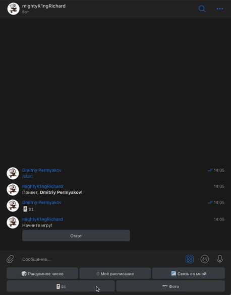

# TelegramBot
 

# [❗this repository is outdated! Follow to new bot](https://github.com/IU5-IT/IU5-IT/tree/master/Term-3/BKIT-2022/03-lab-06-DimaPermyakov)

# Navigation.
- [code of the bot.](https://github.com/mightyK1ngRichard/TelegramBot/blob/main/main.py)
- [cooperative game](https://github.com/mightyK1ngRichard/TelegramBot/blob/main/game.py)

# Little video.

